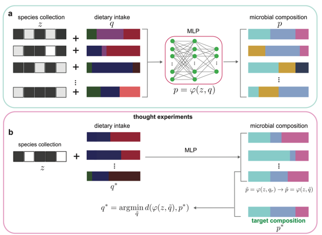

# DPDR (Deep Learning-based Personalized Dietary Recommendations to Achieve Desired Gut Microbial Compositions)
This is a Pytorch implementation of DKI, as described in our paper:

Wang, X.W., Weiss, S.T. and Liu, Y.Y. [Deep Learning-based Personalized Dietary Recommendations to Achieve Desired Gut Microbial Compositions ]. 

  

## Contents
- [Overview](#overview)
- [Environment](#environment)
- [Repo Contents](#repo-contents)
- [Data type for DPDR](#Data-type-for-DKI)
- [How the use the DPDR framework](#How-the-use-the-DPDR-framework)

# Overview

Dietary intervention is an effective way to alter the gut microbiome to promote human health. Yet, due to our limited knowledge of diet-microbe interactions and the highly personalized gut microbial compositions, an efficient method to prescribe personalized dietary recommendations to achieve desired gut microbial compositions is still lacking. Here, we propose a deep learning framework to resolve this challenge. Our key idea is to implicitly learn the diet-microbe interactions by training a deep learning model using paired gut microbiome and dietary intake data of a large population. The well-trained deep learning model enables us to predict the microbial composition of any given species collection and dietary intake. Next, we prescribe personalized dietary recommendations by solving an optimization problem to achieve the desired microbial compositions. We systematically validated this Deep learning-based Personalized Dietary Recommendation (DPDR) framework using synthetic data generated from an established microbial consumer-resource model. We then validated DPDR using real data collected from a diet-microbiome association study. The presented DPDR framework demonstrates the potential of deep learning for personalized nutrition.

# Environment
We have tested this code for Python 3.9.7 and Pytorch 2.1.0.

# Repo Contents
(1) A synthetic dataset to test the Deep Learning-based Personalized Dietary Recommendations (DPDR) framework.

(2) Python code to predict the species composition using species assemblage and dietary profile (MLP).

# Data type for DPDR
## (1) p.csv: matrix of taxanomic profile of size N*M, where N is the number of taxa and M is the sample size (without header).

|           | sample 1 | sample 2 | sample 3 | sample 4 |
|-----------|----------|----------|----------|----------|
| species 1 | 0.45     | 0.35     | 0.86     | 0.77     |
| species 2 | 0.51     | 0        | 0        | 0        |
| species 3 | 0        | 0.25     | 0        | 0        |
| species 4 | 0        | 0        | 0.07     | 0        |
| species 5 | 0        | 0        | 0        | 0.17     |
| species 6 | 0.04     | 0.4      | 0.07     | 0.06     |

## (2) z.csv: pre-intervention species assemblage of size N*M, where N is the number of taxa and M is the sample size (without header).

|           | sample 1 | sample 2 | sample 3 | sample 4 | sample 5 | sample 6 | sample 7 | sample 8 | sample 9 | sample 10 | sample 11 | sample 12 |
|-----------|----------|----------|----------|----------|----------|----------|----------|----------|----------|-----------|-----------|-----------|
| species 1 | 0        | 1        | 1        | 0        | 1        | 1        | 0        | 1        | 1        | 0         | 1         | 1         |
| species 2 | 1        | 0        | 1        | 0        | 0        | 0        | 0        | 0        | 0        | 0         | 0         | 0         |
| species 3 | 0        | 0        | 0        | 1        | 0        | 1        | 0        | 0        | 0        | 0         | 0         | 0         |
| species 4 | 0        | 0        | 0        | 0        | 0        | 0        | 1        | 0        | 1        | 0         | 0         | 0         |
| species 5 | 0        | 0        | 0        | 0        | 0        | 0        | 0        | 0        | 0        | 1         | 0         | 1         |
| species 6 | 1        | 1        | 0        | 1        | 1        | 0        | 1        | 1        | 0        | 1         | 1         | 0         |

## (3) q.csv: dietary profile of size N*M, where S is the number of nutrient/food and M is the sample size (without header).

|           | sample 1 | sample 2 | sample 3 | sample 4 |
|-----------|----------|----------|----------|----------|
| nutrient 1 | 0.019     | 0.018     | 0.012     | 0.018     |
| nutrient 2 | 0.03     | 0.026        | 0.025        | 0.025        |
| nutrient 3 | 0.00085        | 0     | 0        | 0.0005        |
| nutrient 4 | 0.015        | 0.014        | 0.01     | 0.012        |
| nutrient 5 | 0.0019        | 0.0008        | 0.0007        | 0.0008     |
| nutrient 6 | 0.0006     | 0      | 0     | 0.003     |

# How the use the DPDR framework
Run Python code in "code" folder: "DPDR_mapping.py" by taking p.csv, z.csv and q.csv as input will output the predicted microbiome composition.
Example: python DPDR_mapping.py --perturbation $perturbation --'sparsity' $sp --'connectivity' $C --noise $ep --ratio $ratio --fold $fold

